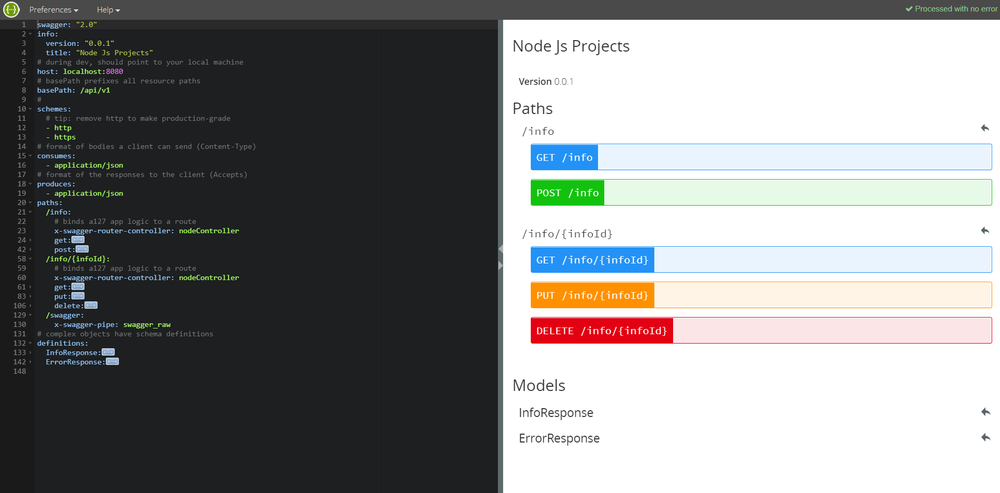

Node Js Project!
-------------------

This project aims to test different frameworks.


# Synthaxe analyser
``` bash
"eslint": "^4.18.1",
"eslint-config-airbnb-base": "^12.1.0",
"eslint-plugin-import": "^2.9.0",
```

.eslintrc.json
``` json
{
  "extends": "airbnb-base",
  "rules": {
    "linebreak-style": 0
  }
}
```


# Utilisation de ES6
``` bash
"babel-cli": "^6.26.0",
"babel-preset-env": "^1.7.0",
```

.babelrc
``` json
{
  "presets": ["env"],
  "plugins": []
}
```

Le code doit être transpilé dans un dossier `dist` (défaut) puis lancé :
``` bash
npm run build & node ./dist/server.js
```

# Utilisation de ES6
``` bash
"babel-cli": "^6.26.0",
"babel-preset-env": "^1.7.0",
```

# Mise en place d'une api
``` bash
"body-parser": "^1.18.2",
"cors": "^2.8.4",
"express": "^4.13.3"
```


# Mise en place d'un swagger
``` bash
npm install -g swagger
```

### Edition de l'interface

``` bash
swagger project edit
```
<p>
  
</p>


### Création d'un endpoint
Swagger-UI configure l'interface à partir d'un json. Pour exploiter le yaml de swagger-editor, utilisation de la librairie yamljs pour parser le fichier.

``` javascript
const swaggerDescription = YAML.load('./api/swagger/swagger.yaml');
app.use('/api-docs', swaggerUi.serve, swaggerUi.setup(swaggerDescription));
``` 
