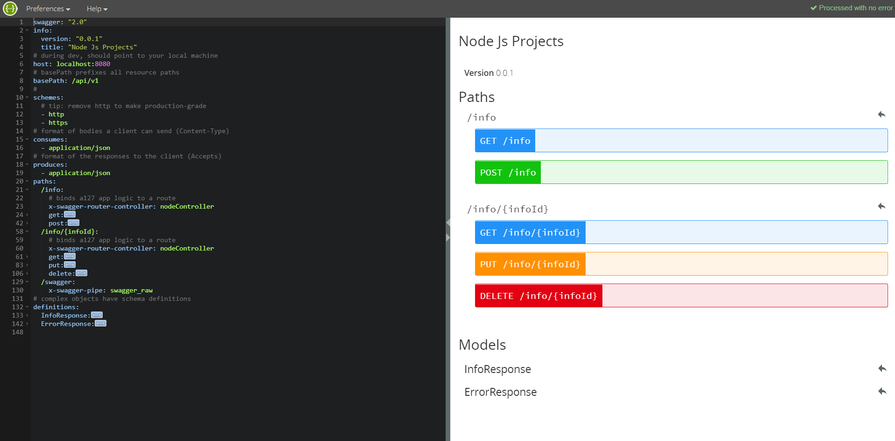

Express-Swagger-MongoDb Project!
-------------------

<p align="center">
    
    
    
</p>


This project expose a express API to manage user. The services are managed by swagger and data saved in a MongoDb database.

# Swagger

### UI edition

Swagger must be intalled as global dependency, <a href="https://www.npmjs.com/package/eslint-config-airbnb">Swagger-editor</a> allows to display a view to manage directly swagger look from a YAML file:

``` bash
npm install -g swagger
swagger project edit
```
<p>
  
</p>


### Endpoint creation

<a href="https://github.com/jeremyfa/yaml.js#readme">yamljs</a> allows to import swagger edition definition and use it to setup swagger-ui.
An endpoint is created to display services swagger.

``` javascript
const swaggerDescription = YAML.load('./api/swagger/swagger.yaml');
app.use('/api-docs', swaggerUi.serve, swaggerUi.setup(swaggerDescription));
``` 

# Mongo Db client

Official <a href="https://github.com/mongodb/node-mongodb-native">MongoDb driver</a> is used as database client.


